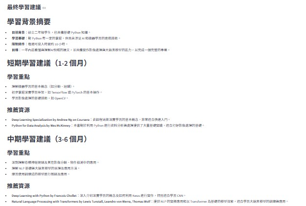
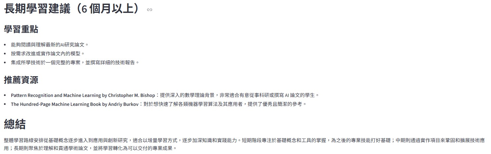

# AI 學習諮詢師

> 輸入你的學習背景與目標，AI 自動規劃個人化學習路線並從書籍資料庫推薦適合的資源。

**技術堆疊：** LangGraph · LangChain · FAISS · BM25 · OpenAI GPT-4o · Streamlit · LangSmith

---

## Demo


---

## 使用範例

**輸入畫面**


**輸出結果（短期 / 中期建議）**



**輸出結果（長期建議 / 總結）**



---

## 系統架構

```
使用者輸入（中文學習目標）
        ↓
  [Planner]  分析背景，規劃短中長期學習路徑
  　　　　　 輸出英文 SEARCH_QUERIES 供檢索
        ↓
  [Hybrid Search]  混合檢索
  　FAISS（語義向量）+ BM25（關鍵字）→ EnsembleRetriever
        ↓
  [Writer]  整合學習規劃與書籍資料，撰寫 Markdown 格式建議
        ↓
  結構化學習計畫輸出（含短/中/長期建議 + 書籍推薦）
```

---

## 技術亮點

- **LangGraph 狀態機**：以 `StateGraph` + `TypedDict` 管理 Agent 協作流程，支援條件分支與重試邏輯
- **混合式語義檢索**：FAISS 密集向量 + BM25 稀疏關鍵字融合（EnsembleRetriever），補足跨語言檢索弱點
- **跨語言橋接**：Planner 自動將中文目標翻譯為英文 SEARCH_QUERIES，使英文書籍資料庫的 BM25 檢索發揮完整效果
- **本地向量知識庫**：基於 Kaggle Goodreads 公開資料集（178 萬筆）清洗取樣 5,000 筆高評分書籍，使用 `multilingual-e5-small` 建立 FAISS 索引
- **輸入防護機制**：LLM 快速分類器過濾非學習諮詢問題，避免無效 API 呼叫
- **LangSmith 追蹤**：自動攔截所有 LLM 呼叫，可視化每步 Token 用量與執行時間

---

## 快速開始

### 1. 建立虛擬環境並安裝套件

```bash
python -m venv llm_env
llm_env\Scripts\activate
pip install -r requirements.txt
```

### 2. 設定環境變數

```bash
cp .env.example .env
# 編輯 .env，填入你的 API 金鑰
```

| 變數 | 說明 | 必填 |
|---|---|---|
| `OPENAI_API_KEY` | OpenAI API 金鑰 | ✅ |
| `OPENAI_MODEL` | 模型名稱（預設 gpt-4o）| |
| `LANGCHAIN_API_KEY` | LangSmith 追蹤金鑰 | 選填 |
| `FAISS_DB_PATH` | 向量資料庫路徑（預設 faiss_db）| |

### 3. 建立向量知識庫

```bash
python build_faiss_db.py
```

> 需先下載 [Goodreads Cleaned Dataset](https://www.kaggle.com/datasets/ishanrealstate/goodreads-cleaned-dataset)，放置於 kagglehub 快取目錄。

### 4. 啟動

```bash
streamlit run main.py
```

---

## 專案結構

```
LLM專案一/
├── main.py              # Streamlit UI + 輸入防護
├── graph.py             # LangGraph 狀態機（Agent 協作流程）
├── agents.py            # LLM 角色定義（Planner / Writer）+ System Prompts
├── retriever.py         # 混合檢索（FAISS + BM25 + EnsembleRetriever）
├── config.py            # 環境變數統一管理
├── build_faiss_db.py    # 向量知識庫建立腳本
├── download_dataset.py  # Kaggle 資料集下載腳本
├── assets/              # Demo 影片與截圖
├── faiss_db/            # 本地向量知識庫（不含於版控）
├── .env.example         # 環境變數範本
└── requirements.txt
```

---

## 注意事項

- `.env` 含 API 金鑰，**請勿上傳至 GitHub**（已加入 `.gitignore`）
- `faiss_db/` 體積較大，**請勿上傳至 GitHub**，執行 `build_faiss_db.py` 在本機重建
- 執行環境：Python 3.10+，不需 GPU
